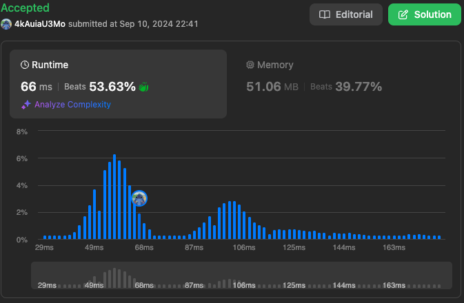

# Two Sum

Given an array of integers `nums` and an integer `target`, return indices of the two numbers such that they add up to `target`.

You may assume that each input would have exactly one solution, and you may not use the same element twice.

You can return the answer in any order.

**Example 1:**
> Input: nums = [2,7,11,15], target = 9 </br>
> Output: [0,1] </br>
> Explanation: Because nums[0] + nums[1] == 9, we return [0, 1].

**Example 2:**
> Input: nums = [3,2,4], target = 6  </br>
> Output: [1,2]

**Example 3:**
> Input: nums = [3,3], target = 6 </br>
> Output: [0,1]

**Constraints:**

- `2 <= nums.length <= 104`
- `-109 <= nums[i] <= 109`
- `-109 <= target <= 109`
- `Only one valid answer exists.`

```javascript
/**
 Time Complexity: O(n^2)

Your solution is indeed effective, but it has several performance issues and areas for improvement, especially when dealing with larger arrays. The main problems are as follows:
1. High Time Complexity
O(n²) Time Complexity: Your solution uses two nested loops, resulting in a time complexity of O(n²). This is inefficient for larger arrays. For example, if the length of nums increases to thousands or tens of thousands, the performance will significantly degrade.

2. Unnecessary Calculations
Redundant Calculations: In the inner loop, you compute the sum for every pair of elements. If a match is not found, those calculations are completely unnecessary. Using a hash table can help avoid redundant calculations and check for matching elements in constant time.

3. Readability and Maintainability
Loop Structure: While your logic is clear, the nested loops are not the most optimal approach, which might confuse other developers when maintaining the code, as this implementation isn't concise or straightforward.
 */
/**
 * @param {number[]} nums
 * @param {number} target
 * @return {number[]}
 */
var twoSum = function(nums, target) {
  const result = []
  for(let i=0,len=nums.length;i<len;i++) {
    for(let j=i+1 ;j<len; j++){
      if(nums[i]+nums[j] === target){
        result.push(i,j)
        break
      }
    }
  }
  return result
}
```


```javascript
/**
 * Time Complexity: O(n)

Improved Solution
You can optimize your code by using a hash map to reduce the time complexity to O(n). Here’s an example of the improved code
 */
/**
 * @param {number[]} nums
 * @param {number} target
 * @return {number[]}
 */
var twoSum = function(nums, target) {
    const map = new Map() // create a hash map
  for(let i=0,len=nums.length;i<len;i++){
    const complement = target - nums[i] // Calculate the complement 
    if(map.has(complement)){ // check if the complement exists in the map
      return [map.get(complement),i] // return the result
    }
    map.set(nums[i],i) // add the current element to the map
  }
  return [] // return an empty array if no solution is found
}
```



[Official Problem Link](https://leetcode.com/problems/two-sum/description/)

[Video Explanation](https://youtu.be/isGKzmwDREg?si=aDoiflHaPkVu11-h)
